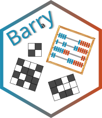

# barry: Your Go-To Motif Accountant (R Package) 


<!-- badges: start -->
[](https://github.com/EpiForeSITE)
[](https://CRAN.R-project.org/package=barry)
[](https://github.com/USCbiostats/barryr/actions/workflows/r.yml)
[](https://cran.r-project.org/package=barry)
[](https://github.com/USCbiostats/barryr/blob/master/LICENSE.md)
[](https://app.codecov.io/gh/USCbiostats/barry)
[](https://CRAN.R-project.org/package=barry)
<!-- badges: end -->

This R package provides the C++ headers from the [barry C++ library](https://github.com/USCbiostats/barry) for use in other R packages.

## Installation

You can install the development version of `barry` from
[GitHub](https://github.com/) with:
    
``` r
devtools::install_github("USCbiostats/barryr")
```

Or from <a href="https://uscbiostats.r-universe.dev/"
target="_blank">R-universe</a> (recommended for the latest development
version):

``` r
install.packages(
  'barry',
  repos = c(
    'https://uscbiostats.r-universe.dev',
    'https://cloud.r-project.org'
  )
)
```

## Code of Conduct

The epiworldR project is released with a [Contributor Code of
Conduct](https://contributor-covenant.org/version/2/1/CODE_OF_CONDUCT.html).
By contributing to this project, you agree to abide by its terms.
